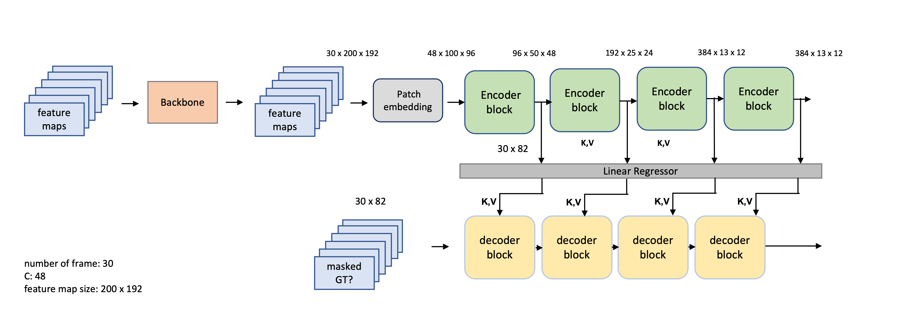
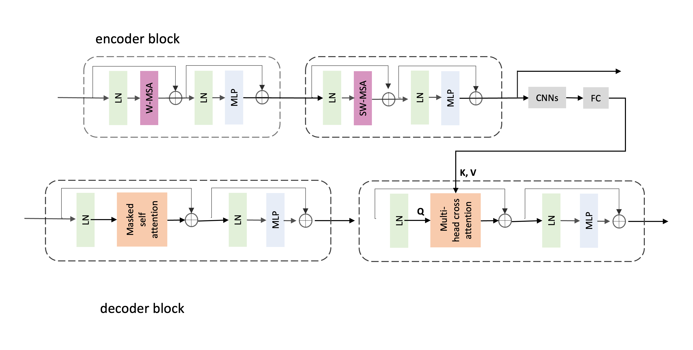

# D3Pose - Double-Masked Encoder-Decoder model for video mesh recovery 

This research project aims to beat SOTA models on video mesh recovery with a novel cross-attention transformer-based model.

## Usage

install the following dependencies

```bash
CLIP

```

## Pipeline


Inspired by the [vanilla transformer](https://arxiv.org/pdf/1706.03762.pdf) in NLP. This paper utilizes an encoder-decoder architecture to strengthen temporal smoothness. The vanilla self-attention module is replaced by the swin transformer module.



## References

- check out [this](references/References.md) for a comprehensive list of SOTA model in mesh recovery.
